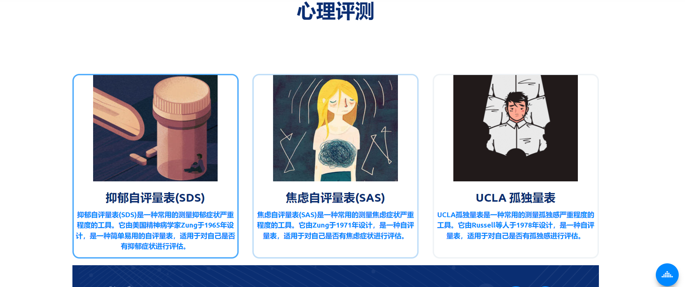
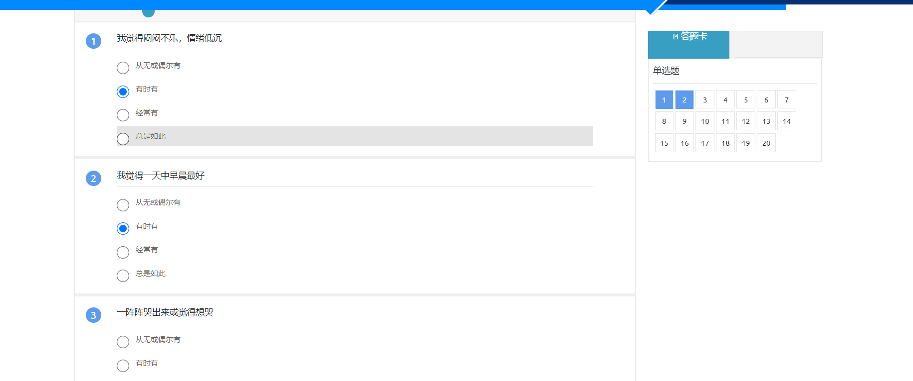
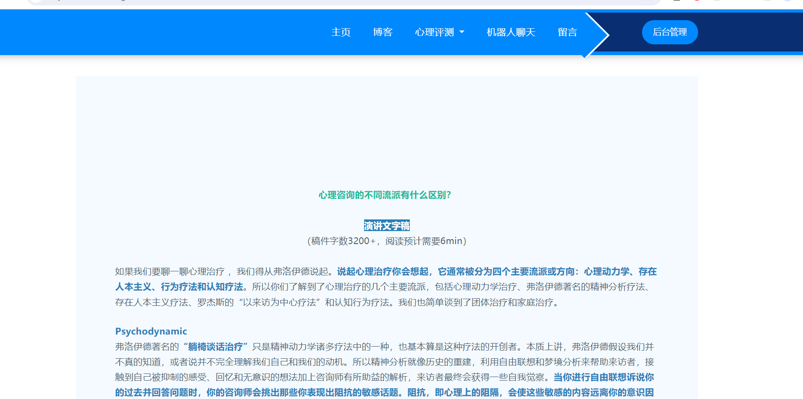
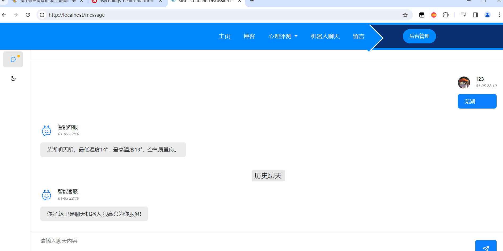
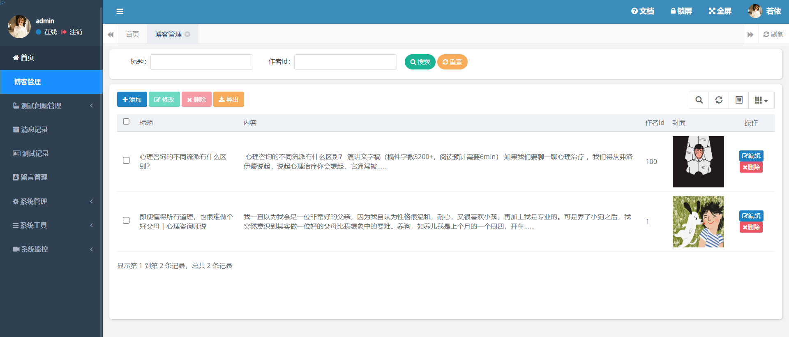
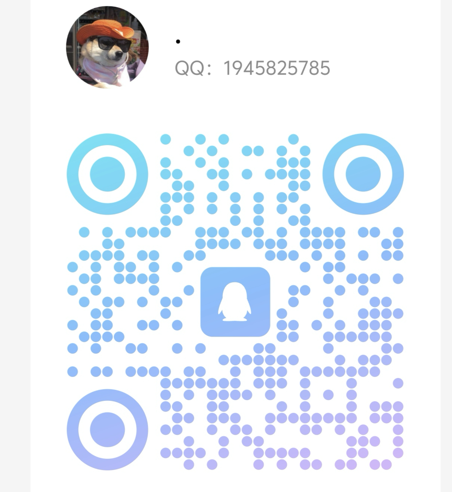

# psychology-health-project

**介绍：**

1. **主页**
2. **心理评测分析**
3. **心理类文章发布**
4. **调用大模型API对话**
5. **留言板**
6. **后台管理系统**

**技术栈：**

- **springboot**
- **thymeleaf**
- **layui**

**项目运行截图：**

  

## 价格（良心价）

1. **99单项目**
2. **149包安装**

